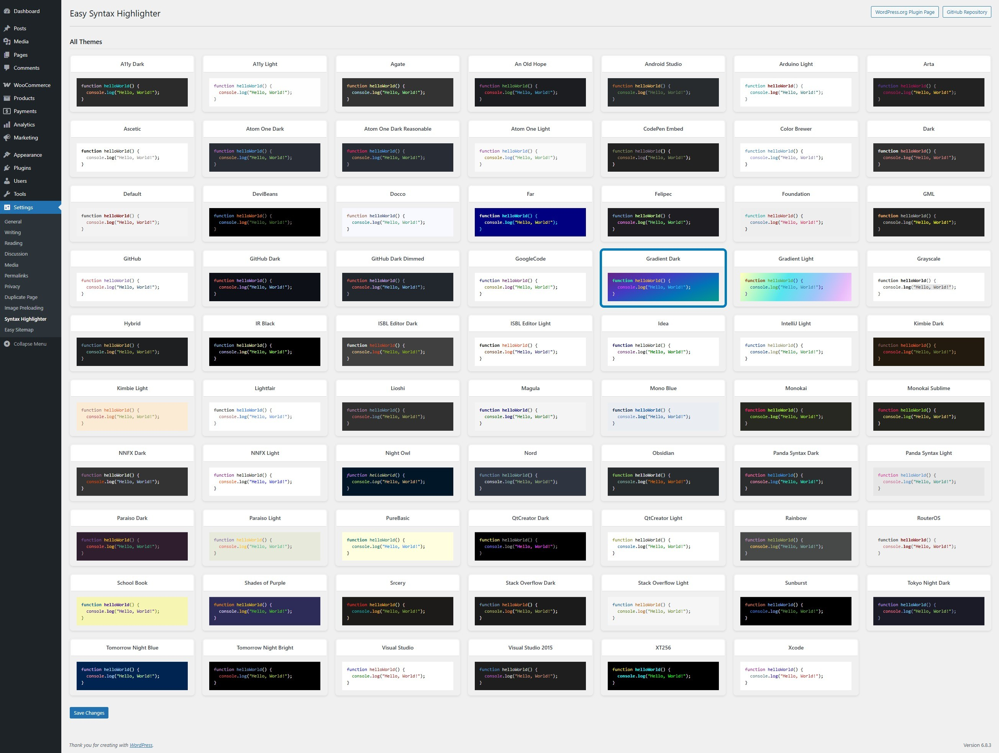
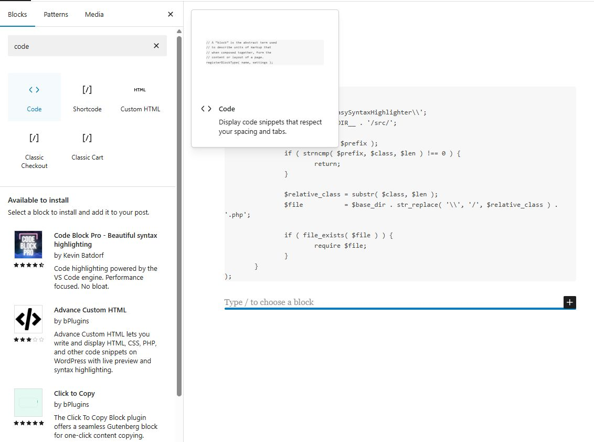
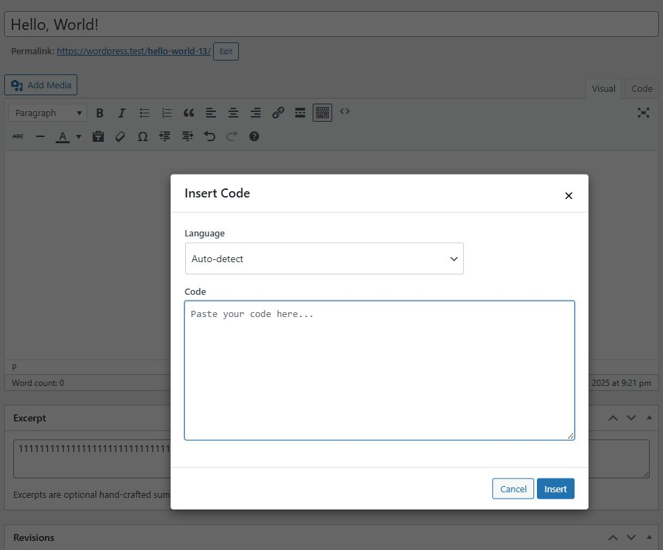
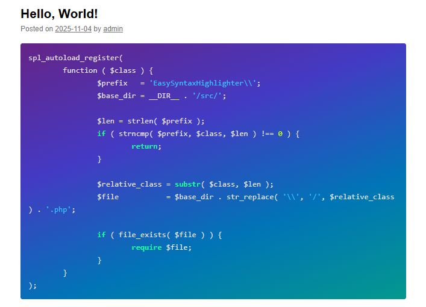

# Easy Syntax Highlighter (WordPress Plugin)

Modern, lightweight [syntax highlighter for WordPress](https://wordpress.org/plugins/easy-syntax-highlighter/) using Highlight.js with support for multiple languages, themes, copy-to-clipboard functionality, and Gutenberg integration.

## ✨ Features

- **Modern Highlight.js Engine**: Uses the latest Highlight.js library for fast, accurate syntax highlighting
- **80+ Themes Included**: Over 80 themes for both light and dark modes, all stored locally for offline compatibility
- **Visual Theme Selector**: Clean admin interface with grid layout for easy theme selection
- **Wide Language Support**: Supports 20+ programming languages including JavaScript, PHP, Python, CSS, HTML, SQL, Bash, and more
- **TinyMCE Integration**: Adds a button to the classic editor for easily inserting code blocks
- **Copy to Clipboard**: Double-click any code block to instantly copy its content with localized feedback messages
- **Performance Optimized**: Smart asset loading—only loads when needed
- **Responsive Design**: Works beautifully on all devices
- **Security Focused**: Proper input sanitization and output escaping
- **Localization Ready**: Translation-ready with proper text domains
- **Gutenberg Integration**: Seamless integration with the block editor

## 📸 Screenshots

| Settings & theme selector | Code block in editor |
|---------------------------|----------------------|
|  |  |

| Frontend highlighting | Classic editor |
|------------------------|----------------|
|  |  |

## 📋 Requirements

- **WordPress**: 5.0+
- **PHP**: 7.0+
- **MySQL**: 5.6+

## 🚀 Installation

1. Download and extract the plugin files
2. Upload the `easy-syntax-highlighter` folder to `wp-content/plugins/`
3. Activate the plugin through WordPress admin → **Plugins**
4. Go to **Settings → Syntax Highlighter** to configure options
5. Start using the syntax highlighter in your posts and pages

## 📖 Usage

### Basic Setup

1. After activation, the plugin automatically highlights code in the default Gutenberg "Code" block.
2. In the Gutenberg editor, add a "Code" block.
3. Paste your code into the block.
4. In the block settings panel on the right, specify the language for your code (e.g., `javascript`, `php`).
5. Publish and enjoy beautiful syntax highlighting on your website's frontend.

### Gutenberg Block Editor (Recommended)

This plugin works by automatically applying syntax highlighting to the **default WordPress "Code" block**.

1. Click the `+` button and add a "Code" block.
2. Paste your code into the block.
3. The plugin will **automatically detect the language** on the front end of your website.

**Forcing a specific language (Advanced):**
If the automatic detection is not correct, you can manually specify a language:
1. Select the Code block.
2. Click the three-dot menu in the block's toolbar and choose "Edit as HTML".
3. Find the `<code>` tag and add a class with the language name, like this: `<code class="language-javascript">`.
4. Click "Edit visually" to return to the normal view.

### Classic Editor

1. Use the TinyMCE button (code icon) in the editor toolbar to open the code insertion modal.
2. Paste your code, select the language from the dropdown, and click "Insert".

### Configuration Options

#### Basic Settings
- **Theme Selection**: Choose from over 80 different color themes using a visual theme selector
- **Language Support**: Automatic language detection or manual selection
- **Copy to Clipboard**: Double-click any code block to copy (enabled by default)

#### Advanced Options
- **Performance**: Assets only load when code blocks are present
- **Security**: Proper input sanitization and validation
- **Accessibility**: Screen reader friendly with proper ARIA labels

## ⚙️ Configuration

### Settings Page

Located in **Settings → Syntax Highlighter**:

The settings page includes quick access buttons to the WordPress.org plugin page and GitHub repository for support and updates.

1. **Theme Selection**: Visual grid layout with live previews for all 80+ themes
2. **Language Settings**: Configure supported languages and auto-detection
3. **Performance Options**: Control asset loading and caching
4. **Copy Functionality**: Enable/disable double-click to copy feature

### Theme Selection

The plugin includes popular themes like:
- GitHub (Light/Dark)
- Monokai
- Atom One (Light/Dark)
- VS Code
- Dracula
- And 70+ more...

## 🐛 Troubleshooting

### Code Not Highlighting

1. **Check Block Type**: Ensure you're using the correct Gutenberg block or shortcode
2. **Language Selection**: Verify the correct programming language is selected
3. **Theme Loading**: Check browser console for CSS loading errors
4. **Plugin Updates**: Ensure the plugin is updated to the latest version

### Performance Issues

1. **Asset Loading**: The plugin only loads assets when code blocks are present
2. **Caching**: Clear any caching plugins if themes don't update
3. **Browser Cache**: Hard refresh (Ctrl+F5) to clear browser cache

### Copy to Clipboard Not Working

1. **JavaScript Enabled**: Ensure JavaScript is enabled in your browser
2. **Console Errors**: Check browser developer tools for JavaScript errors
3. **Double-click**: Make sure to double-click directly on the code block

### Theme Not Applying

1. **Theme Selection**: Verify theme is selected in settings
2. **CSS Loading**: Check if theme CSS files are accessible
3. **Cache Clearing**: Clear WordPress and browser caches

## 📄 License

Licensed under the GNU General Public License v2.0 or later.

```
Copyright (C) 2025 snowbedding

This program is free software; you can redistribute it and/or modify
it under the terms of the GNU General Public License as published by
the Free Software Foundation; either version 2 of the License, or
(at your option) any later version.
```

## 🤝 Contributing

1. Fork the repository
2. Create a feature branch
3. Make your changes
4. Test thoroughly
5. Submit a pull request

---

**Made with ❤️ for the WordPress community**
